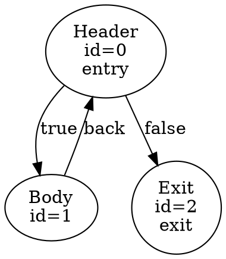

# CFG Structurizer - Method Reference Guide

## Quick Method Index

### Public Methods

| Method | Purpose | Returns |
|--------|---------|---------|
| `CFGStructurizer()` | Constructor | - |
| `run()` | Full structurization | `bool` |
| `run_trivial()` | Simple mode | `bool` |
| `traverse()` | Emit structured code | `void` |
| `get_entry_block()` | Get entry after transform | `CFGNode*` |
| `rewrite_rov_lock_region()` | Handle ROV locks | `bool` |
| `rewrite_auto_group_shared_barrier()` | Fix barriers | `void` |
| `flatten_subgroup_shuffles()` | Simplify shuffles | `void` |
| `fixup_loop_header_undef_phis()` | Fix undefined PHIs | `void` |

### Private Analysis Methods

| Method | Purpose |
|--------|---------|
| `visit()` | Forward DFS traversal |
| `visit_for_back_edge_analysis()` | Detect back edges |
| `backwards_visit()` | Reverse traversal |
| `build_immediate_dominators()` | Compute dominance tree |
| `build_immediate_post_dominators()` | Compute post-dominance tree |
| `build_reachability()` | Build reachability bitset |
| `query_reachability()` | O(1) reachability query |

### Private Transform Methods

| Method | Purpose |
|--------|---------|
| `structurize()` | Main transformation loop |
| `find_loops()` | Identify loops |
| `find_selection_merges()` | Identify if/else |
| `find_natural_switch_merge_block()` | Find switch merge |
| `analyze_loop()` | Analyze loop structure |
| `analyze_loop_merge()` | Find loop merge point |

### Private Utility Methods

| Method | Purpose |
|--------|---------|
| `create_ladder_block()` | Create intermediate block |
| `insert_phi()` | Add PHI nodes |
| `eliminate_degenerate_blocks()` | Remove empty blocks |
| `split_merge_blocks()` | Break complex merges |
| `log_cfg()` | Debug output |
| `log_cfg_graphviz()` | GraphViz output |

---

## Detailed Method Specifications

### Constructor

```cpp
CFGStructurizer(CFGNode *entry, CFGNodePool &pool, SPIRVModule &module)
```

**Parameters**:
- `entry`: Entry block of the CFG
- `pool`: Memory pool for creating new nodes
- `module`: SPIR-V module for code generation

**Initialization**:
- Creates exit block
- Clears analysis data structures
- Initializes empty vectors/sets

**Purpose**: Set up structurizer for processing

---

### `run()` - Main Structurization

```cpp
bool CFGStructurizer::run()
```

**Algorithm**:
```
1. Perform analysis phase
   - visit() - forward traversal
   - backwards_visit() - reverse traversal
   - build_immediate_dominators()
   - build_immediate_post_dominators()
   - build_reachability()

2. Iterative structurization
   - Loop until convergence:
     - find_loops()
     - find_selection_merges()
     - structurize()
     - Check for changes

3. Post-processing
   - split_merge_blocks()
   - eliminate_degenerate_blocks()
   - cleanup_breaking_phi_constructs()
   - insert_phi()
   - fixup_broken_value_dominance()
   - rewrite_invalid_loop_breaks()
   - eliminate_degenerate_switch_merges()
   - rewrite_transposed_loops()
   - serialize_interleaved_merge_scopes()
   - serialize_interleaved_early_returns()

4. Special transforms
   - propagate_branch_control_hints()
   - remove_unused_ssa()
```

**Return Value**:
- `true` - Structurization succeeded
- `false` - Fallback needed (rare)

**Time Complexity**: O(I × (V + E)) where I = iterations

---

### `run_trivial()` - Simplified Mode

```cpp
bool CFGStructurizer::run_trivial()
```

**Purpose**: Handle simple CFGs that don't need full restructuring

**Features**:
- No dominance analysis
- No iterative structurization
- Only handles obvious loops/selections
- Much faster for simple shaders

**Return Value**:
- `true` - Trivial structurization applied
- `false` - Full mode needed

**When Used**:
- High-optimization builds
- Simple shaders
- When full mode fails

---

### `traverse()` - Code Emission

```cpp
void CFGStructurizer::traverse(BlockEmissionInterface &iface)
```

**Purpose**: Walk structured CFG and emit SPIR-V code

**Parameters**:
- `iface`: Callback interface for code generation

**Algorithm**:
```cpp
for each block in structured order:
    iface.register_block(node);    // Register for jumps
    iface.emit_basic_block(node);  // Generate code
```

**Dependencies**:
- Must be called after `run()` succeeds
- CFG must be fully structured
- All merge points must be defined

---

### `visit()` - Forward Traversal

```cpp
void CFGStructurizer::visit(CFGNode &entry)
```

**Purpose**: Depth-first traversal from entry block

**What It Does**:
1. Visits each reachable node
2. Records post-order sequence
3. Identifies back edges (edges to already-visited nodes)
4. Marks loop headers

**Post-Order Array**:
- `forward_post_visit_order[i]` = i-th node in post-order
- Used for dominance computation
- Back edges = (child, ancestor in post-order)

**Algorithm (DFS)**:
```
visit(node):
    if visited[node]: return
    mark visited[node] = true
    
    for each successor:
        if not visited[successor]:
            visit(successor)  // Recursive
        else if successor is ancestor in call stack:
            mark as back edge
    
    append node to post_order
```

**Result**: 
- Forward post-order sequence
- Back edge identification
- Loop header detection

---

### `build_immediate_dominators()` - Dominance Tree

```cpp
void CFGStructurizer::build_immediate_dominators()
```

**Purpose**: Compute immediate dominator for each node

**Algorithm**: Lengauer-Tarjan algorithm
```
1. Process nodes in reverse post-order
2. For each node n:
   - For each predecessor p:
     - Find idom(p)
     - Compute deepest common ancestor
   - idom[n] = LCA of all predecessors
```

**Result**:
- `idom[n]` = immediate dominator of n
- Each node knows its dominator
- Enables dominance queries

**Usage**:
- Check if A dominates B: follow idom chain
- Find common dominator: LCA in idom tree

---

### `build_immediate_post_dominators()` - Post-Dominance

```cpp
void CFGStructurizer::build_immediate_post_dominators()
```

**Purpose**: Compute immediate post-dominator for each node

**Algorithm**: Reverse domination calculation
```
1. Reverse all edges
2. Compute dominators on reversed graph
3. Reverse post-domination relationships
```

**Post-Dominance Definition**:
- B post-dominates A if all paths from A to exit go through B
- Used to find merge points

**Result**:
- `idom_post[n]` = immediate post-dominator
- Merge block identification

---

### `build_reachability()` - Reachability Analysis

```cpp
void CFGStructurizer::build_reachability()
```

**Purpose**: Precompute which nodes reach which nodes

**Algorithm**:
```
1. Allocate bitset: V × (V/64) bits
2. Initialize: reachability[n][n] = true
3. For each node in reverse post-order:
   4. Mark reachability to successors
   5. Propagate transitively
```

**Storage**:
- Bitset indexed as `[node_from * stride + word]`
- Each bit represents one target node
- Stride = number of words to store V bits

**Complexity**:
- Space: O(V²) bits ≈ O(V²/64)
- Build: O(V + E)
- Query: O(1)

---

### `find_loops()` - Loop Detection

```cpp
bool CFGStructurizer::find_loops(unsigned pass)
```

**Purpose**: Identify and structurize loops

**Algorithm**:
```
for each node with back edges:
    This is a LOOP HEADER
    
    1. Collect loop blocks
       - All nodes reachable from header before exiting
    
    2. Analyze loop exits
       - Identify which blocks leave the loop
    
    3. Determine merge point
       - Post-dominator of all loop blocks
       - Or implicit if infinite loop
    
    4. Handle special cases
       - Multiple back edges → Unified continue block
       - Nested loops → Recursive analysis
       - Infinite loops → No merge
    
    5. Mark as structured loop
```

**Return Value**: `true` if any loops found and restructured

**Key Data**:
```cpp
struct LoopAnalysis {
    Vector<CFGNode *> direct_exits;          // Exit edges
    Vector<CFGNode *> inner_direct_exits;    // In nested loops
    Vector<CFGNode *> dominated_exit;        // Post-dominated
    Vector<CFGNode *> non_dominated_exit;    // Escape construct
    Vector<CFGNode *> dominated_continue_exit; // Continue edges
};
```

---

### `find_selection_merges()` - Selection Detection

```cpp
void CFGStructurizer::find_selection_merges(unsigned pass)
```

**Purpose**: Identify if/else structures

**Algorithm**:
```
for each node without back edges:
    if has conditional terminator:
        SELECTION HEADER (if statement)
        
        1. Get both targets
           - True branch target
           - False branch target
        
        2. Find merge block
           - Node where both paths meet
           - Post-dominator of both targets
           - Dominated by header
        
        3. Classify merge type
           - Simple: both branches reach merge
           - Asymmetric: one exits
           - Complex: branches reconnect elsewhere
        
        4. Mark selection
           - Set header and merge
           - Update control flow info
```

**Merge Classification**:
- **Simple**: Both branches clearly reconverge
- **Asymmetric**: One branch doesn't reach merge
- **Complex**: Branches loop back or cross

---

### `analyze_loop()` - Loop Structure Analysis

```cpp
LoopAnalysis CFGStructurizer::analyze_loop(CFGNode *node) const
```

**Purpose**: Detailed analysis of loop structure

**Returns** `LoopAnalysis` struct with:
- `direct_exits` - Edges leaving loop body
- `inner_direct_exits` - Exits inside nested loops
- `dominated_exit` - Post-dominated by loop
- `non_dominated_exit` - Non-dominated (escape outer)
- `dominated_continue_exit` - Continue edges

**Algorithm**:
```
1. Collect all blocks in loop
2. For each block:
   - If exits loop → add to exits
   - Analyze post-dominance relationship
   - Classify by exit type
3. Return classification
```

**Usage**: Guides loop merge target selection

---

### `analyze_loop_merge()` - Merge Point Determination

```cpp
LoopMergeAnalysis CFGStructurizer::analyze_loop_merge(
    CFGNode *node, const LoopAnalysis &analysis)
```

**Purpose**: Find where loop merges to

**Returns** `LoopMergeAnalysis`:
- `merge` - Primary merge block
- `weak_merge` - Secondary merge candidate
- `dominated_merge` - Post-dominated merge
- `infinite_continue_ladder` - For infinite loops

**Algorithm**:
```
1. Find post-dominator of all loop blocks
   - This is the merge point

2. Handle special cases:
   - Infinite loop: no merge
   - Multiple non-dominated exits: need ladder
   - Escaping edges: go to outer merge

3. Determine merge type
   - Structured: clear single merge
   - Weak: multiple candidates
   - Infinite: no exit
```

---

### `create_ladder_block()` - Intermediate Block

```cpp
CFGNode *CFGStructurizer::create_ladder_block(
    CFGNode *header, CFGNode *node, const char *tag)
```

**Purpose**: Create intermediate block for complex control flow

**Parameters**:
- `header` - Loop/selection header
- `node` - Target block
- `tag` - Name for debugging

**Algorithm**:
```cpp
1. Create new CFGNode
   ladder = pool.create_node()

2. For each predecessor of node:
   if header dominates predecessor:
       retarget: pred → ladder (was pred → node)

3. Connect ladder to node:
   ladder → node

4. Update PHI nodes:
   - Add incoming from ladder
   - Mark as ladder source
```

**Result**: Intermediate dispatching point

**Before**:
```
Header
  / \
 B1 B2 → Target
```

**After**:
```
Header
  / \
 B1 B2 → Ladder → Target
```

---

### `insert_phi()` - PHI Node Insertion

```cpp
void CFGStructurizer::insert_phi()
```

**Purpose**: Add PHI nodes at merge points

**Algorithm** (Iterative):
```
while changes:
    for each block:
        if block has multiple predecessors:
            for each variable with different versions from predecessors:
                if no phi for this variable:
                    create phi node
                    phi.incoming = collect from each pred
```

**PHI Node Definition**:
```cpp
struct PHI {
    spv::Id result_id;          // Output value
    Vector<IncomingValue> incoming;  // Input from each predecessor
};

struct IncomingValue {
    CFGNode *block;             // Predecessor block
    spv::Id value_id;           // Value from predecessor
};
```

**Result**: SSA form maintained

---

### `fixup_broken_value_dominance()` - SSA Validation

```cpp
void CFGStructurizer::fixup_broken_value_dominance()
```

**Purpose**: Fix violated SSA form from transformations

**Problem**: After CFG rewrites, some uses might not be dominated by definitions

**Solution**:
```
for each use:
    if use is not dominated by definition:
        find common merge point
        insert phi node there
        continue iterating until fixed
```

**Result**: Valid SSA form restored

---

### `rewrite_invalid_loop_breaks()` - Break Target Fixing

```cpp
bool CFGStructurizer::rewrite_invalid_loop_breaks()
```

**Purpose**: Fix break statements targeting wrong merge blocks

**Problem**:
```
for (;;) {
    if (cond1) break outer_loop;  ← Might target wrong merge
    if (cond2) break inner_loop;
}
```

**Solution**:
```
for each break instruction:
    1. Determine intended target loop
    2. Find actual merge block
    3. If targets don't match:
       - Insert ladder block
       - Redirect break to ladder
       - Ladder dispatches to correct merge
```

**Return**: `true` if any breaks fixed

---

### `eliminate_degenerate_blocks()` - Block Cleanup

```cpp
void CFGStructurizer::eliminate_degenerate_blocks()
```

**Purpose**: Remove unnecessary blocks

**Types Removed**:
1. **Empty blocks** - No instructions, single successor
2. **PHI-only blocks** - Only PHI nodes, single successor
3. **Redundant blocks** - Duplicate of single predecessor

**Algorithm**:
```
for each block:
    if block is degenerate:
        merge block with successor:
        - move instructions
        - move terminators
        - update predecessors
        - update PHI nodes
```

**Result**: Simplified CFG

---

### `split_merge_blocks()` - Complex Merge Handling

```cpp
void CFGStructurizer::split_merge_blocks()
```

**Purpose**: Break merge blocks with complex predecessors

**Problem**:
```
Multiple selection/loop headers
  |        |
  +─→ Merge ←─+

All merge through one block
```

**Solution**:
```
Create intermediate blocks:

Selection1
     |
  Intermediate1
     |
  Intermediate2
     |
  Merge ←─ Selection2
```

**Result**: Clearer structured control flow

---

### `log_cfg()` - Text Debugging

```cpp
void CFGStructurizer::log_cfg(const char *tag) const
```

**Output Format**:
```
======== [tag] =========
Block Header [id=0, entries=1]
  Operations: 5
  Terminator: Conditional br [true→Body, false→Exit]
  Merge: Selection merge to ExitBlock
  Dominance: dom=Entry, idom_post=Exit
  
Block Body [id=1, entries=1]
  Operations: 3
  Terminator: Unconditional br [→Header]
  Merge: None
  Loop: Header with back edge
  
Block Exit [id=2, entries=2]
  Operations: 1
  Terminator: Return
  Merge: Selection merge from Header
====== END [tag] =======
```

---

### `log_cfg_graphviz()` - Visual Debugging

```cpp
void CFGStructurizer::log_cfg_graphviz(const char *path) const
```

**Output Format** (DOT):


**Visualization**:
```bash
dot -Tpng -o cfg.png cfg.dot
# Opens cfg.png showing graph structure
```

---

## Helper Functions

### `query_reachability()` - O(1) Reachability

```cpp
bool CFGStructurizer::query_reachability(
    const CFGNode &from, const CFGNode &to) const
```

**Complexity**: O(1)

**Implementation**:
```cpp
size_t from_idx = node_index[&from];
size_t to_idx = node_index[&to];

size_t word_idx = to_idx / 32;
size_t bit_idx = to_idx % 32;

return (reachability_bitset[from_idx * stride + word_idx] 
        >> bit_idx) & 1;
```

---

### `block_is_load_bearing()` - Block Necessity Check

```cpp
bool CFGStructurizer::block_is_load_bearing(
    const CFGNode *node, const CFGNode *merge) const
```

**Purpose**: Determine if block contains critical operations

**Returns** `true` if:
- Block contains real instructions (not just branches)
- Block prevents optimization/merging
- Block must remain for correctness

---

### `control_flow_is_escaping()` - Escape Detection

```cpp
bool CFGStructurizer::control_flow_is_escaping(
    const CFGNode *node, const CFGNode *merge) const
```

**Purpose**: Check if execution can escape a construct

**Returns** `true` if:
- Path from node doesn't reach merge
- Control flow exits to outer construct
- Non-local jump detected

---

## Summary Table

| Method | Complexity | Purpose |
|--------|-----------|---------|
| `run()` | O(I×(V+E)) | Main algorithm |
| `visit()` | O(V+E) | Forward traversal |
| `build_*_dominators()` | O(V+E) | Dominance/Post-dom |
| `build_reachability()` | O(V+E) | Reachability |
| `find_loops()` | O(V+E) | Loop detection |
| `find_selection_merges()` | O(V+E) | Selection detection |
| `create_ladder_block()` | O(pred_count) | Ladder creation |
| `insert_phi()` | O(I×V) | PHI insertion |
| `query_reachability()` | O(1) | Reachability query |

Where I = number of iterations (typically 3-50)

